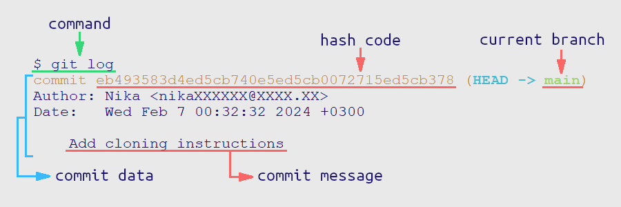

# README.md

## Шпаргалочка по командам Git и выживанию 

```bash
# перейти в папку проекта
$ cd foldername 

# создать локальный репозиторий в текущей папке
$ git init

# добавить файл filename.txt к отслеживанию
# или запомнить новое состояние после изменения
$ git add filename.txt

# добавить все файлы к отслеживанию
$ git add --all

# проверить текущее состояние локального репозитория
$ git status

# подтвердить состояние добавленных файлов с комментарием
$ git commit -m "comment"

# отправить изменения с локального в удалённый репозиторий
$ git push -u origin main

#притянуть чужие изменения из удалённого репозитория в локальный
$ git pull

# посмотреть историю событий
$ git log

# привязать локальный репозиторий к удалённому репозиторию через SSH
# выполняется в корневой папке проекта
# origin - стандартный псевдоним
$ git remote add origin git@github.com:username/projectname.git

# проверить подключение удалённого репозитория
$ git remote -v

```


## Клонировать/скачать проект из GitHub (без JUnit)

1. Форкнуть чужой репозиторий;
2. Default ветка master или main? См. пункт *"Изменить master ветку на main"*
3. Скопировать HTTPS ключ/url;
4. В GitBash пойти в общую папку, где будет лежать папка проекта:
```bash
# cd /d/P/dev_folder/
```
5. Выполнить команду: 
```bash
$ git clone https://...
```
6. В общей папке создастся папка проекта со скачанными данными, инициализированным локальным репозиторием и привязкой к удалённому репозиторию на GitHub.


## Клонировать/скачать проект из GitHub (с JUnit тестами)
1. Форкнуть чужой репозиторий;
2. Default ветка master или main? См. пункт *"Изменить master ветку на main"*
3. Скопировать HTTPS ключ/url *или* пристегнуть аккаунт GitHub к IntelliJ IDEA (один раз);
4. Пойти в IntelliJ IDEA -> File -> New -> Project from Version Control...;
5. Если ссылка - Repository URL; если аккаунт - выбрать проект из списка;
6. Указать папку, куда положить проект;
7. Нажать кнопку Clone;
8. Подождать;
9. Пойти File -> Project Structure -> Project Settings -> Project;
10. Указать JDK/SDK: corretto-21; Language level: SDK default; нажать ОК;
11. Папка *src* -> контекстное меню -> Mark Directory as -> Sources Root;
12. Папка *test* -> контекстное меню -> Mark Directory as -> Test Sources Root;
13. Проверить библиотеки JUnit: пойти File -> Project Structure -> Project Settings -> Libraries -> папка lib содержит около 16 jar файлов;
14. Профит.


## Изменить master ветку на main

### До скачивания репозитория на локальный компьютер

Между шагами 1 и 3:
1. Пойти на GitHub;
2. Войти в репозиторий;
3. Настройки репозитория;
4. Default branch;
5. Rename branch ✏;
6. Изменить *master* на *main*;
7. Сохранить, подождать;
8. Вернуться к шагу 3.

### Если локальная копия уже существует
1. Пойти на GitHub;
2. Войти в репозиторий;
3. Настройки репозитория;
4. Default branch;
5. Rename branch ✏;
6. Изменить *master* на *main*;
7. Сохранить, подождать;
8. В папке проекта в GitBash выполнить команды:
```bash
$ git branch -m master main
$ git fetch origin
$ git branch -u origin/main main
$ git remote set-head origin -a
```


## Конфигурация локального GitBash
```bash
# делает переносы строк линуксовыми
# выполнить один раз и навсегда
$ git config --global core.autocrlf true


```

## Информация по структуре git




### hash

Хэш — уникальный идентификатор коммита. 
Отпечаток информации о коммите, преобразованной через алгоритм SHA-1.
Строка из 40 шестнадцатиричных символов.

Информация о коммите: дата, автор, содержимое файлов и ссылка на родительский коммит.

Хэш используется для однозначного определения нужного коммита и операций с ним.


### log

```bash
# посмотреть полноразмерный лог
# полный hash коммита, дата, автор, комментарий
$ git log

# посмотреть краткий лог
# краткий hash коммита, комментарий
$ git log --oneline
```

### HEAD

HEAD -> main - метка последнего коммита в ветке *main*.

Метка HEAD может использоваться вместо уникального хэша.

Физически HEAD - файл в папке .git/, содержит ссылку на .git/refs/heads/main.

В файле .git/refs/heads/main хранится хэш последнего коммита.


